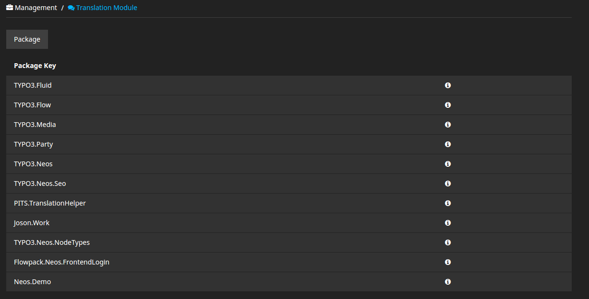
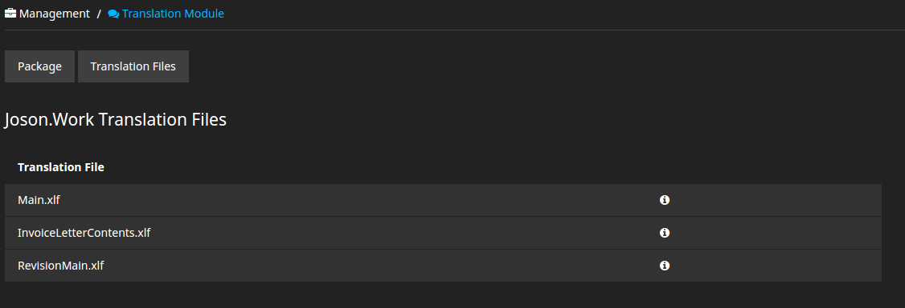
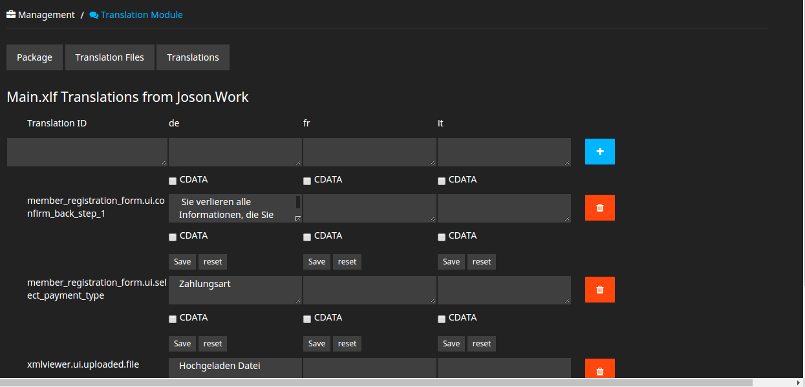

**********************
PITS.TranslationHelper
**********************
This backend plugin is used for managing translations in the translation files of NEOS CMS.

Installation steps
******************
- First Install this NEOS CMS plugin using composer.
  ::

    composer require pits/translationhelper

- Add following in top level Configuration/Routes.yaml just after the TYPO3 Neos route.
  ::

    -
	  name: 'pitsTranslationHelper'
	  uriPattern: '<pitsTranslationHelperSubroutes>'
	  defaults:
		'@package': 'PITS.TranslationHelper'

	  subRoutes:
		'pitsTranslationHelperSubroutes':
		  package: 'PITS.TranslationHelper'

- Flush all caches using the below command
  ::

    php ./flow neos.flow:cache:flush

- Warm up caches using the below command
  ::

    php ./flow neos.flow:cache:warmup

- Open your NEOS CMS site backend, then you can see **Translation Module** under  **Management** main module.

Plugin Details
**************
- First page of this backend plugin contains a list of packages that contain translation files.

- If a user click any of the package, then this particular user enters into the translation files list page. The below screenshot shows the list of translation files inside **Joson.Work** package.

- If a user click any of the translation file, then this particular user enters into the translation units list page. The below screenshot shows the list of translation units inside **Main.xlf** file.

uninstall step
**************

- Remove this package using composer.
  ::

    composer remove pits/translationhelper

- remove completely below mentioned route configuration code from Configuration/Routes.yaml file.
  ::

    -
	  name: 'pitsTranslationHelper'
	  uriPattern: '<pitsTranslationHelperSubroutes>'
	  defaults:
		'@package': 'PITS.TranslationHelper'

	  subRoutes:
		'pitsTranslationHelperSubroutes':
		  package: 'PITS.TranslationHelper'
		  

- Flush all caches using the below command
  ::

    php ./flow neos.flow:cache:flush

- Warm up caches using the below command
  ::

    php ./flow neos.flow:cache:warmup
